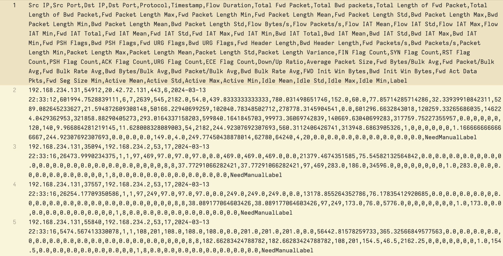
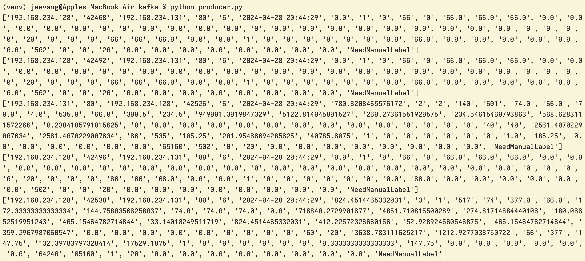
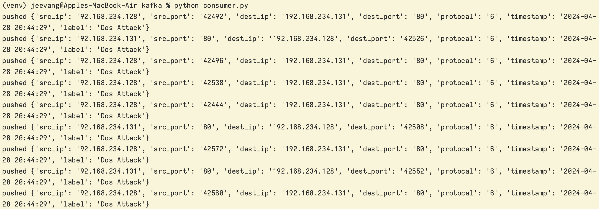
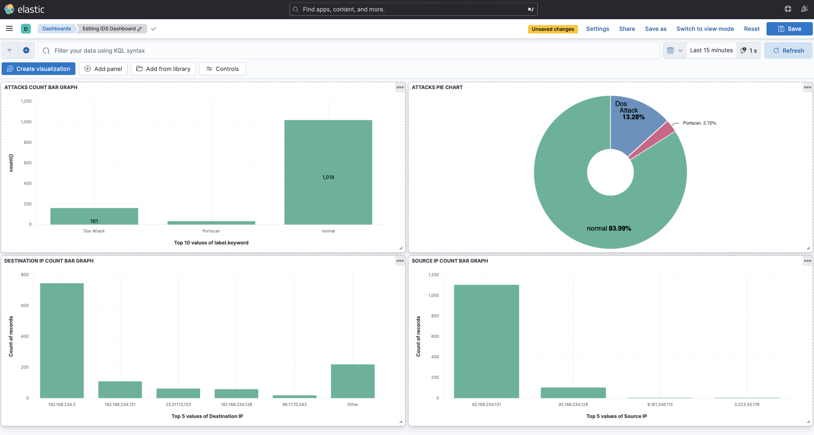

# A-Real-Time-NIDS-based-on-Transformer-LSTM-model
A Real-Time Network Intrusion Detection System based on Transformer-LSTM model (Major Project)

## Features
- Real time intrusion detection with high accuracy
- Includes attacks like Golden eye Dos and port scan
- Easy datastream pipline using kafka and ELK stack
- Nice kibana dashboard and network Analysis

## Prerequisites
- python 3.11 or above
- Docker

## Installation
1. Get this repo : https://github.com/jackjeevan/A-Real-Time-NIDS-based-on-Transformer-LSTM-model.git
2. Run: cd  A-Real-Time-NIDS-based-on-Transformer-LSTM-model
3. Run: " pip install -r requirements.txt " to install necessary modules
4. If required train model from the directory "Model"
5. Run: cd FlowGenerator
6. Run: python3 main.py -i <interface_name> -c (Note: Get interface name from "ifconfig" / "ipconfig")
7. open new four terminal windows with this main directory
8. (new terminal window) cd kafka
9. run: docker-compose -f Dockerkafka.yml up
10. (new terminal window) cd elastic-search
11. run: docker-compose -f docker-elastic-search.yml up
12. (new terminal window) cd kafka
13. run: python3 producer.py
14. run: python3 consumer.py
15. open browser head over to "https://localhost:5601"

## Working
- Packets get processed from flowgenerator program and stored in flow.csv file.
- Kafka-python client producer reads flow.csv file content and pushes to a topic.
- Kafka-python client consumer fetch data from that topic and processes it to feed to trained model.
- Predicted result will be sent to elasticsearch index
- Prebuilt kibana dashboard is used to display threats and network analysis

## Screenshots

 

